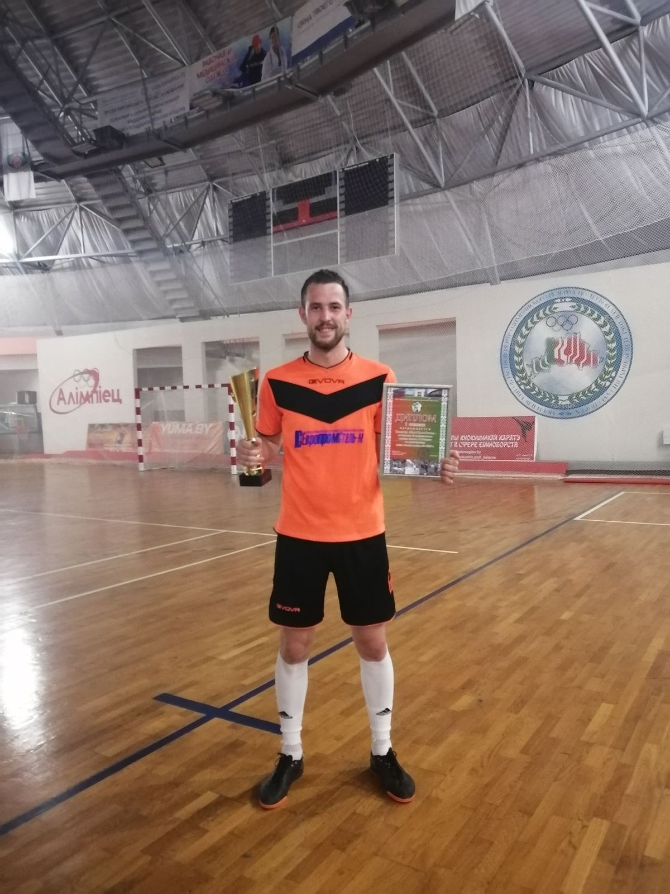

# Aliaksei Latypau

  Front-end developer
  
## Contact

  * e-mail: alex.latypov94@gmail.com;
  * phone: +375(29)266-47-20
  * Telegram: @alexlatypov
  * LinkedIn: <https://www.linkedin.com/in/aliaksei-latypau-75b9a31b8/>
  
## Summary

  *I completed the course of The Rolling Scopes School in JavaScript / Front-end. Learned how to write scripts, create SPA and MPA applications. Mastered Git version control system and Webpack project builder. Worked with the Three.js library. I have experience as a freelancer, created landing pages. I am currently learning React.*
  
## Skills 

  * HTML5
  * CSS3
  * SCSS
  * JavaScript ES6
  * Git
  * Webpack
  
## Code example

  * You can see my works in the repository: <https://github.com/alexlatypov94>

## Education

  * *Belorussian-Russian university (2017 specialist)*
  * *Belorussian-Russian university (2018 magistracy)*
  * *courses of basic objective-oriented programming*
  * *The Rolling Scopes School JavaScript/Front-end*
  
## English

  English (A2+)
